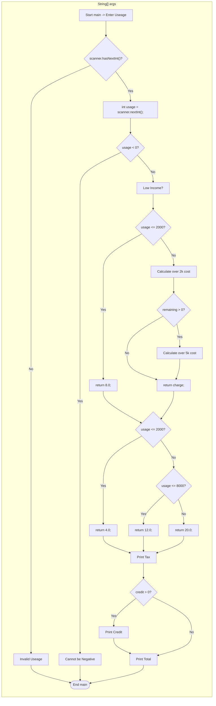

# Chart

```mermaid
flowchart TB
  subgraph main ["String[] args"]
    direction TB
    M_START[Start main -> Enter Useage] --> M_HAS_INT{"scanner.hasNextInt()?"}  
    M_HAS_INT -- No --> M_INVALID_INPUT["Invalid Useage"]
    M_INVALID_INPUT --> M_END([End main])  
    M_HAS_INT -- Yes --> M_READ["int usage = scanner.nextInt();"]  
    M_READ --> M_NEGATIVE{"usage < 0?"}  
    M_NEGATIVE -- Yes --> M_NEGATIVE_MSG["Cannot be Negative"]
    M_NEGATIVE_MSG --> M_END  
    M_NEGATIVE -- No --> M_LOW_PROMPT["Low Income?"]  
    M_LOW_PROMPT --> W_LOW{"usage <= 2000?"}
    W_LOW -- Yes --> W_RET_LOW["return 8.0;"]
    W_RET_LOW --> S_LOW{"usage <= 2000?"}
    W_LOW -- No --> W_INIT["Calculate over 2k cost"]
    W_INIT --> W_HIGH{"remaining > 0?"}
    W_HIGH -- Yes --> W_ADD_HIGH["Calculate over 5k cost"]
    W_HIGH -- No --> W_RET
    W_ADD_HIGH --> W_RET["return charge;"] 
    W_RET --> S_LOW
    S_LOW -- Yes --> S_RET4["return 4.0;"] 
    S_LOW -- No --> S_MID{"usage <= 8000?"}  
    S_MID -- Yes --> S_RET12["return 12.0;"] 
    S_MID -- No --> S_RET20["return 20.0;"]
    S_RET4 --> M_PRINTS["Print Tax"]
    S_RET12 --> M_PRINTS
    S_RET20 --> M_PRINTS  
    M_PRINTS --> M_CREDIT{"credit > 0?"}  
    M_CREDIT -- Yes --> M_PRINT_CREDIT["Print Credit"]
    M_PRINT_CREDIT --> M_TOTAL["Print Total"]
    M_CREDIT -- No --> M_TOTAL
    M_TOTAL --> M_END  
  end
```
